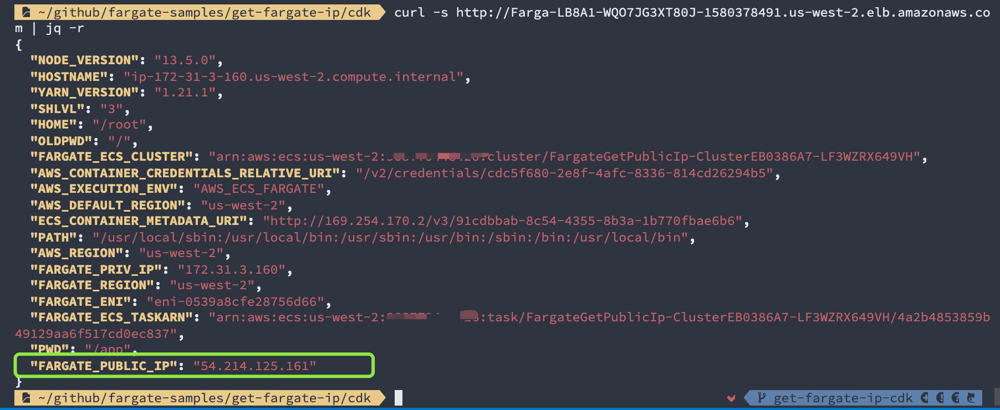

# get-public-ip

This sample demonstrates how to get Fargate task **public IP, private IP, Cluster name, Task ARN** and other info right from the nodejs application running in the Fargate task.


## Demo

1. Prepare your AWS CDK environment. ([Getting Started with AWS CDK](https://docs.aws.amazon.com/cdk/latest/guide/getting_started.html))

2. Deploy with AWS CDK

```bash
$ cd cdk
# deploy into a new VPC
$ cdk deploy 
# or alternatively, deploy into the default VPC
$ cdk deploy -c USE_DEFAULT_VPC=1
```

On deployment completed, you get the **ServiceURL** in the output.

```
Outputs:
FargateGetPublicIp.ServiceURL = http://Farga-LB8A1-WQO7JG3XT80J-1580378491.us-west-2.elb.amazonaws.com
```

cURL the ServiceURL

```bash
$ curl -s http://Farga-LB8A1-WQO7JG3XT80J-1580378491.us-west-2.elb.amazonaws.co
m | jq -r
{
  "NODE_VERSION": "13.5.0",
  "HOSTNAME": "ip-172-31-3-160.us-west-2.compute.internal",
  "YARN_VERSION": "1.21.1",
  "SHLVL": "3",
  "HOME": "/root",
  "OLDPWD": "/",
  "FARGATE_ECS_CLUSTER": "arn:aws:ecs:us-west-2:112233445566:cluster/FargateGetPublicIp-ClusterEB0386A7-LF3WZRX649VH",
  "AWS_CONTAINER_CREDENTIALS_RELATIVE_URI": "/v2/credentials/cdc5f680-2e8f-4afc-8336-814cd26294b5",
  "AWS_EXECUTION_ENV": "AWS_ECS_FARGATE",
  "AWS_DEFAULT_REGION": "us-west-2",
  "ECS_CONTAINER_METADATA_URI": "http://169.254.170.2/v3/91cdbbab-8c54-4355-8b3a-1b770fbae6b6",
  "PATH": "/usr/local/sbin:/usr/local/bin:/usr/sbin:/usr/bin:/sbin:/bin:/usr/local/bin",
  "AWS_REGION": "us-west-2",
  "FARGATE_PRIV_IP": "172.31.3.160",
  "FARGATE_REGION": "us-west-2",
  "FARGATE_ENI": "eni-0539a8cfe28756d66",
  "FARGATE_ECS_TASKARN": "arn:aws:ecs:us-west-2:112233445566:task/FargateGetPublicIp-ClusterEB0386A7-LF3WZRX649VH/4a2b4853859b49129aa6f517cd0ec837",
  "PWD": "/app",
  "FARGATE_PUBLIC_IP": "54.214.125.161"
}
```

And you can get the **FARGATE_PUBLIC_IP** in the JSON response.




## clean up

```bash
$ cdk destroy
```


## How it works?

Read `fargate-samples/get-fargate-ip/dockerAssets.d/run.sh` to see how it gets all the info and bootstraps the `FARGATE_*` environment variables for nodeJS.
