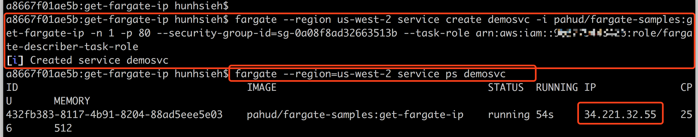
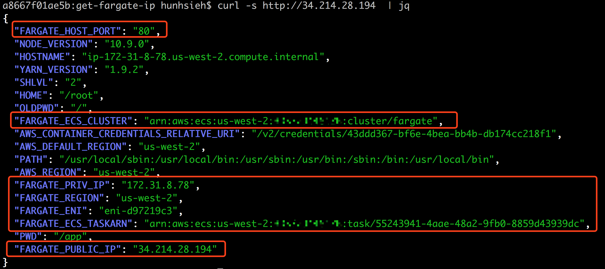

# get-public-ip

This sample demonstrates how to get Fargate task **public IP, private IP, Cluster name, Task ARN** and other info right from the nodejs application running in the Fargate task.


## Demo

create a sample service(demosvc) with the pre-built docker image listening on port 80.

```
$ fargate --region us-west-2 service create demosvc -i pahud/fargate-samples:get-fargate-ip -n 1 -p 80 --security-group-id=sg-0a08f8ad32663513b --task-role arn:aws:iam::{AWS_ACCOUNT_ID}:role/fargate-describer-task-role
[i] Created service demosvc
```

list the task and get the public IP

```
$ fargate --region=us-west-2 service ps demosvc
ID					IMAGE					STATUS	RUNNING	IP		CPU	MEMORY
55243941-4aae-48a2-9fb0-8859d43939dc	pahud/fargate-samples:get-fargate-ip	running	40s	34.214.28.194	256	512
```




cURL the public IP to see the response

```
$ curl -s 34.214.28.194 | jq
```





## clean up

```
//scale to 0
$ fargate --region=us-west-2 service scale demosvc 0

//destroy the service
fargate --region=us-west-2 service destroy demosvc
```


## How it works?

Read `fargate-samples/get-fargate-ip/run.sh` to see how it gets all the info and bootstraps the `FARGATE_*` environment variables for nodeJS.