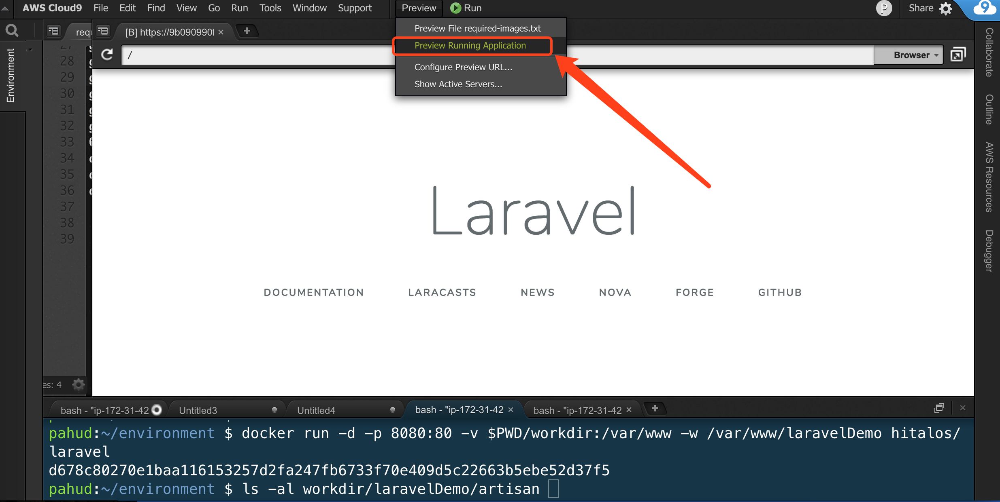

# laravel-demo

This is a demo repository running PHP **LaravelDemo** project in local laptop or Cloud9 IDE.  The Docker image is based on [hitalos/laravel](https://github.com/hitalos/laravel).  We'll create a new project from scratch and start the docker container with the volume mount to map local dir into the docker container.

By volume mount the local `workdir` we will be able to develop the Lavarel applicatoin locally with favorite IDE and run or reload the application straight in docker.

## create Laravel project

create a new Laravel project to `./workdir`

```
docker run -ti -v $PWD/workdir:/var/www -w /var/www hitalos/laravel composer create-project --prefer-dist laravel/laravel laravelDemo
```

this will create a new Laravel project in `./workdir/laravelDemo`


## Start the Laravel project with Docker

```
$ docker run -d -p 8080:80 -v $PWD/workdir:/var/www -w /var/www/laravelDemo hitalos/laravel               
```

this will execute the `./workdir/laravelDemo/artisan` and listening on host port `8080`


## Previw the application

open http://localhost:8080 from your local laptop. If you are running in Cloud9, click `Preview Running Application` to view the web page from the built-in browser.





# Next

check [laravel-workshop](https://github.com/pahud/fargate-samples/blob/master/laravel-workshop/README.md) and see how to containerize your Laravel app, pushing to Amazon ECR and eventually deploy it in AWS Fargate.


