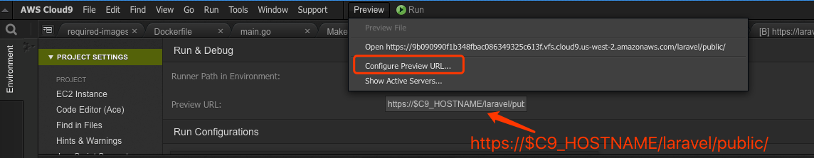
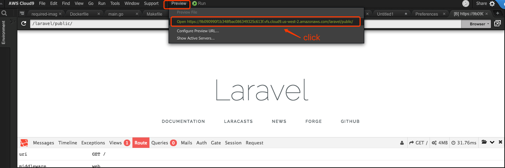
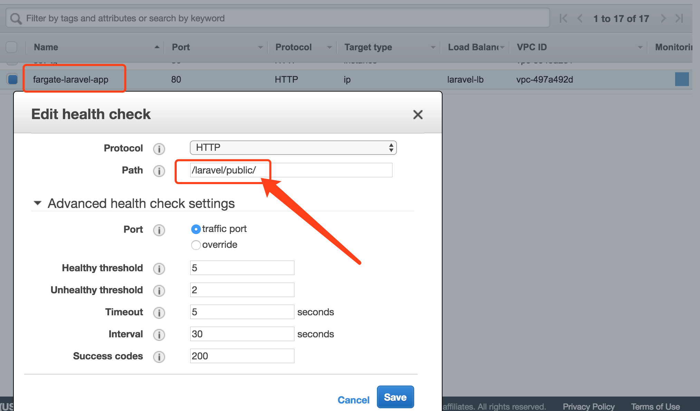
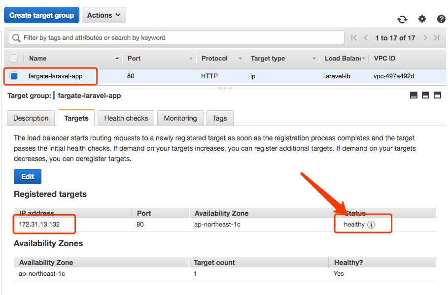
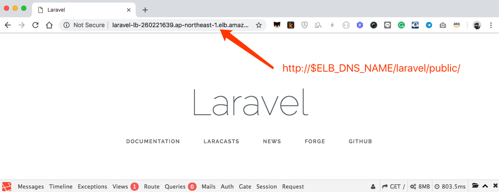

This content is originally designed for [AWS Hands-on Workshop - Laravel on AWS](https://aws.amazon.com/tw/events/aws-handson-workshop-31/) delivered on Nov 5th, 2018 in Taipei.

# Laravel with php7-apache 

This is a reference sample for Laravel application running with php7-apache and evencually deploy to AWS Fargate

# Pre-requisities

Prepare your docker environment in your laptop or just open an [AWS Cloud9 IDE](https://aws.amazon.com/tw/cloud9/). 


# download the repository

```
$ curl -L https://github.com/pahud/fargate-samples/archive/master.zip -o fargate-samples.zip
$ unzip fargate-samples.zip
$ cd fargate-samples-master/laravel-workshop
```


# Build

build the base image and the laravel image on top of it

```
$ make build
```

this will build `udn/laravel:latest` from local docker environment.

# Run

local run this image 

```
$ make run
#http://localhost:8080/laravel/public/
docker inspect laravel-php7-apache > /dev/null && docker rm -f laravel-php7-apache
laravel-php7-apache
docker run -d --name laravel-php7-apache -p 8080:80 udn/laravel
98e1df69d5b110a9dc8596797080b82c77c283f94ee2ce07430bddb4cde90f9e
```
The application will start and listen on localhost:8080

# Validate

open **http://localhost:8080/laravel/public/** from your laptop to view the Laravel application

Alternatively, if you run it on AWS Cloud9, you can configure the preview URL as `https://$C9_HOSTNAME/laravel/public/`



And click `open https://....` to preview the Laravel in the built-in browser in Cloud9




# Deploy to AWS Fargate

Now, let's deploy our Laravel application to **AWS Fargate** as a service behind **Application Load Balancer(ALB)**.


## Create ECR repository and push image to it

Let's create a repo named `larval-php7-apache` in Tokyo region(ap-northeast-1)

```
$ aws --region ap-northeast-1 ecr create-repository --repository-name laravel-php7-apache                                                                                                       
{
    "repository": {
        "registryId": "903779448426", 
        "repositoryName": "laravel-php7-apache", 
        "repositoryArn": "arn:aws:ecr:ap-northeast-1:903779448426:repository/laravel-php7-apache", 
        "createdAt": 1541336935.0, 
        "repositoryUri": "903779448426.dkr.ecr.ap-northeast-1.amazonaws.com/laravel-php7-apache"
    }
}
```

Please copy the `repositoryUri`.


tag the local image to the repositoryUri


```
$ docker tag udn/laravel 903779448426.dkr.ecr.ap-northeast-1.amazonaws.com/laravel-php7-apache
```

(please note your `repositorUri` will be diffierent with the one provided above)

Before pushing the image to ECR, we need to get the ECR authentication and `docker login` with it.

```
$ eval $(aws --region ap-northeast-1 ecr get-login --no-include-email)
WARNING! Using --password via the CLI is insecure. Use --password-stdin.
WARNING! Your password will be stored unencrypted in /home/ec2-user/.docker/config.json.
Configure a credential helper to remove this warning. See
https://docs.docker.com/engine/reference/commandline/login/#credentials-store

Login Succeeded
```

 

OK. Let's push to ECR.

```
$ docker push 903779448426.dkr.ecr.ap-northeast-1.amazonaws.com/laravel-php7-apache
The push refers to repository [903779448426.dkr.ecr.ap-northeast-1.amazonaws.com/laravel-php7-apache]
a797ce820dfe: Preparing 
a8afb4402278: Preparing 
1b5955f85fa0: Preparing 
c5b2b609701b: Preparing 
02ebe3cdea78: Preparing 
7d6b701198fc: Preparing 
b6a32b275451: Preparing 
cedd2c6af07d: Preparing 
cffa45b3d73b: Preparing 
30710577ed35: Preparing 
9dde5b507c6d: Preparing 
a797ce820dfe: Pushed 
342011fbffb0: Pushed 
698846166606: Pushed 
6d2074126c98: Pushed 
407b8eabaf7b: Pushed 
948014d7d5b5: Pushed 
dfb37f70db86: Pushed 
ffe905bce35f: Pushed 
b45ac0bf6d34: Pushed 
356a6f89647e: Pushed 
daf2729b547b: Pushed 
c097549f28a9: Pushed 
5fe1f6c5e675: Pushed 
369e6fd590f3: Pushed 
1805144065e1: Pushed 
b6311cdc5fb6: Pushed 
e30181a94bbf: Pushed 
481da43a1302: Pushed 
a4ace4ed0385: Pushed 
fd29e0f8792a: Pushed 
687dad24bb36: Pushed 
237472299760: Pushed 
latest: digest: sha256:eafd42fd5f848b88c3fe72166c0a5568faccd9c570c8d2fdaff3809a57d1074c size: 7206
```


Now the Docker image is in ECR(Tokyo region). We'll process to the next step to use `fargate-cli` to launch the service.


## Prepare Fargate-CLI

Please follow the [instruction](https://github.com/pahud/fargate-samples/issues/1) to install the `fargate-cli`


### Create an ALB in Tokyo Region with Fargate-CLI

```
$ fargate --region ap-northeast-1 lb create laravel-lb --port 80
[i] Created load balancer laravel-lb
```


### Create the service behind the ALB

```
$ fargate --region ap-northeast-1 service create laravel-app --lb laravel-lb --image 903779448426.dkr.ecr.ap-northeast-1.amazonaws.com/laravel-php7-apache --port 80 --num 1
[i] Created service laravel-app

```

### 

### Service list, ps and info

```
$ fargate --region ap-northeast-1 service list
NAME		IMAGE									CPU	MEMORY	LOAD BALANCER	DESIRED	RUNNING	PENDING	
laravel-app	903779448426.dkr.ecr.ap-northeast-1.amazonaws.com/laravel-php7-apache	256	512	laravel-lb	1	1

$ fargate --region ap-northeast-1 service ps laravel-app
ID					IMAGE									STATUS	RUNNING	IP		CPU	MEMORY	
cc95244f-72d2-4d8a-8241-9c8361f2c8e7	903779448426.dkr.ecr.ap-northeast-1.amazonaws.com/laravel-php7-apache	pending	1m21s	18.182.53.209	256	512


$ fargate --region ap-northeast-1 service info laravel-app
Service Name: laravel-app
Status: 
  Desired: 1
  Running: 0
  Pending: 1
Image: 903779448426.dkr.ecr.ap-northeast-1.amazonaws.com/laravel-php7-apache
Cpu: 256
Memory: 512
Subnets: subnet-a7f831ee, subnet-1d040645, subnet-a68ad08e
Security Groups: sg-ca99d4b2
Load Balancer: 
  Name: laravel-lb
  DNS Name: laravel-lb-260221639.ap-northeast-1.elb.amazonaws.com
  Ports: 
    HTTP:80: 
      Rules: DEFAULT=

Tasks
ID					IMAGE									STATUS	RUNNING	IP		CPU	MEMORY	DEPLOYMENT	
cc95244f-72d2-4d8a-8241-9c8361f2c8e7	903779448426.dkr.ecr.ap-northeast-1.amazonaws.com/laravel-php7-apache	pending	1m28s	18.182.53.209	256	512	1

Deployments
ID	IMAGE									STATUS	CREATED				DESIRED	RUNNING	PENDING
1	903779448426.dkr.ecr.ap-northeast-1.amazonaws.com/laravel-php7-apache	primary	2018-11-04 13:42:55 +0000 UTC	1	1

Events
[2018-11-04 13:43:04 +0000 UTC] (service laravel-app) has started 1 tasks: (task cc95244f-72d2-4d8a-8241-9c8361f2c8e7).


```


### Update the Health Check on Target Group

ALB Target Group by default will health check `HTTP` on `/`, however, as we run laravel app at `/laravel/public/` we need to modify the health check point from `/` to `/laravel/public/`




And make sure the target is `healthy`




### Validate

Get the Load Balancer `DNS Name` from the `fargate service info` above and visit the DNS Name directly

```
http://$YOUR_ELB_DNS_NAME/laravel/public/
```




## Service scale out or scale in


```
// add 2
$ fargate --region ap-northeast-1 service scale laravel-app +2
[i] Scaled service laravel-app to 3
// set to 5
$ fargate --region ap-northeast-1 service scale laravel-app 5
[i] Scaled service laravel-app to 5
// set to 1
$ fargate --region ap-northeast-1 service scale laravel-app 1
[i] Scaled service laravel-app to 1
// set to 0
$ fargate --region ap-northeast-1 service scale laravel-app 0
[i] Scaled service laravel-app to 0
```


## Clean up and destroy the service


```
// always set to 0 before destroying the service
$ fargate --region ap-northeast-1 service scale laravel-app 0
[i] Scaled service laravel-app to 0
// destroy the service
$ fargate --region ap-northeast-1 service destroy laravel-app 
[i] Destroyed service laravel-app
// destroy the ALB
$ fargate --region ap-northeast-1 lb destroy laravel-lb
[i] Destroyed load balancer laravel-lb
```


# Contributors and Credits

The content is originally contributed by **[Paul Pang](https://www.linkedin.com/in/paul-pang-0a446a137/)** and **[Sam Hsieh](https://www.linkedin.com/in/sheng-lung-hsieh-875797a7/)** from **UDNgroup.com** in Oct 2018.
