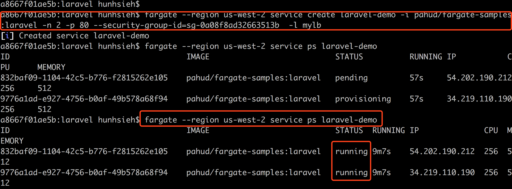
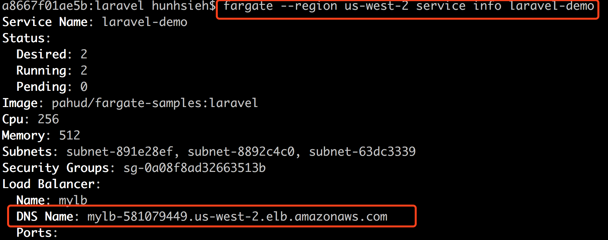
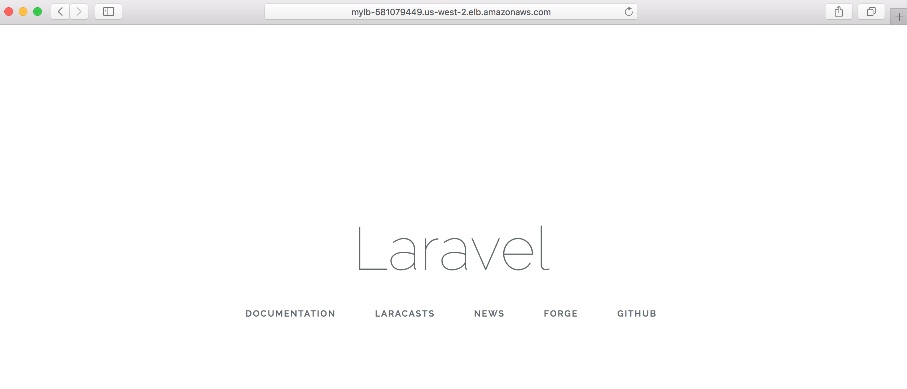
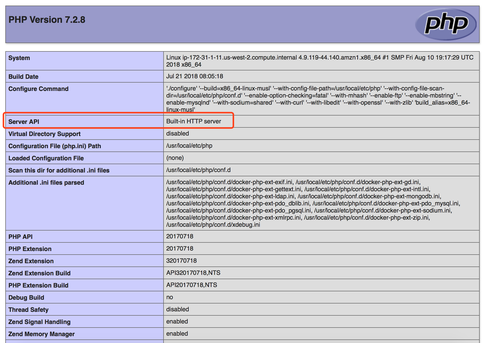

# laravel-demo

This is a demo repository running PHP **LaravelDemo** project in **AWS Fargate**.  The Docker image is based on [hitalos/laravel](https://github.com/hitalos/laravel). Please note the web server running on HTTP port 80 is the built-in **artisan** server.


# running laravelDemo on AWS Fargate with Fargate CLI


```
$ fargate --region us-west-2 service create laravel-demo -i pahud/fargate-samples:laravel -n 2 -p 80 --security-group-id=sg-0a08f8ad32663513b -l mylb
```

(This will take 30-60 seconds waiting for Fargate provisioning and pending for pulling Docker image from docker hub)


check and make sure the tasks are all `running`

```
$ fargate --region us-west-2 service ps laravel-demo
ID					IMAGE				STATUS	RUNNING	IP		CPU	MEMORY
832baf09-1104-42c5-b776-f2815262e105	pahud/fargate-samples:laravel	running	9m7s	54.202.190.212	256	512
9776a1ad-e927-4756-b0af-49b578a68f94	pahud/fargate-samples:laravel	running	9m7s	34.219.110.190	256	512
```




check the **Load Balancer** info and open the DNS name of the Load Balancer.

```
$ fargate --region us-west-2 service info laravel-demo

Service Name: laravel-demo
Status:
  Desired: 2
  Running: 2
  Pending: 0
Image: pahud/fargate-samples:laravel
Cpu: 256
Memory: 512
Subnets: subnet-891e28ef, subnet-8892c4c0, subnet-63dc3339
Security Groups: sg-0a08f8ad32663513b
Load Balancer:
  Name: mylb
  DNS Name: mylb-581079449.us-west-2.elb.amazonaws.com
```




```
$ curl -s http://mylb-581079449.us-west-2.elb.amazonaws.com | grep -m1 title
        <title>Laravel</title>
```



or check the `phpinfo` page at **http://{LB_DNS_NAME}}/phpinfo.php**




# Clean up

```
$ fargate --region us-west-2 service scale laravel-demo 0
[i] Scaled service laravel-demo to 0
$ fargate --region us-west-2 service destroy laravel-demo
[i] Destroyed service laravel-demo
```

