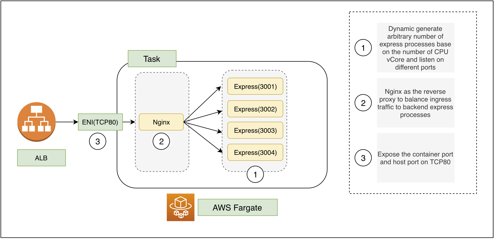
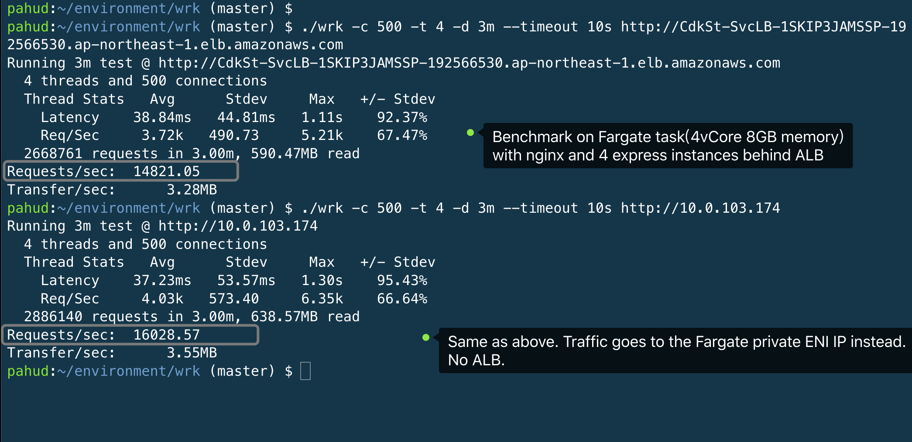

# Nginx proxy for nodeJS on AWS Fargate

This sample refarch builds a nginx-proxied express application running on AWS Fargate with multiple CPU vCore support.


## Why running multiple express instances

**AWS Fargate** is a serverless compute platform which gives you multiple options of different task size ranges from 2 vCore to 4 vCore of CPU and 256MB to 8GB of memory. As NodeJS is designed to execute as single threaded, we need to leverage other modules or applications to spawn multiple NodeJS processes that utilizes all available CPU vCores in AWS Fargate task. In many cases, the cluster module, forever or PM2 might be a very common practice, while in others, we may prefer nginx as the reverse proxy to balance the traffic across 2 or 4 express instances without touching any node source codes.

#### Benefits using Nginx over PM2 or cluster

1. Nginx is a very stable and performant reverse proxy and it works very well with almost any HTTP web services even those running with legacy versions of nodeJS.
2. Have the freedom and flexibility to decouple the HTTP routing logic from your existing express/nodejs code. For example, to redirect or block the traffic based on specific HTTP headers/requests patterns.




## Deploy

```bash
$ cdk deploy
```

And you will get the ALB URL in the CDK response


## Test and validate

```bash
# curl on the ALB and you get the Pid of the running nodejs process
$ curl http://CdkSt-SvcLB-36UP2J5LRTAX-1255472168.ap-northeast-1.elb.amazonaws.com
Pid 53 
# fire 100 requests on the ALB and sort the response
for i in `seq 100`                                     
do               
curl -s http://CdkSt-SvcLB-36UP2J5LRTAX-1255472168.ap-northeast-1.elb.amazonaws.com
done | sort -nr | uniq -c
  25 Pid 53
  24 Pid 47
  26 Pid 41
  25 Pid 40
# the requests are pretty much spread across all available 4 CPU vCores
```


# Benchmarks

Benchmarks on **EC2 m5.xlarge** instance


Benchmarks on **AWS Fargate** Task(4 vCore 8GB memory)



| Requests/sec | Type                                                         | Rank |
| ------------ | ------------------------------------------------------------ | ---- |
| 8,595        | EC2(m5.xlarge) with direct single Express visit              | 4    |
| 15,139       | EC2(m5.xlarge) with Nginx and 4 Express instances            | 2    |
| 14,821       | Fargate(4 vCore 8GB) for Nginx and 4 Express instances + ALB | 3    |
| **16,028**   | Fargate(4 vCore 8GB) for Nginx and 4 Express instances. No ALB. Direct Fargate ENI visit. | 1    |


# Conclusion

AWS Fargate task(4 vCore 8GB) running Nginx with 4 Express instances *without* ALB gains the best performance, even slightly better than running on m5.xlarge EC2 instance. However, for scalibility and high availability consideration,  Fargate with ALB would still be the best choice.
